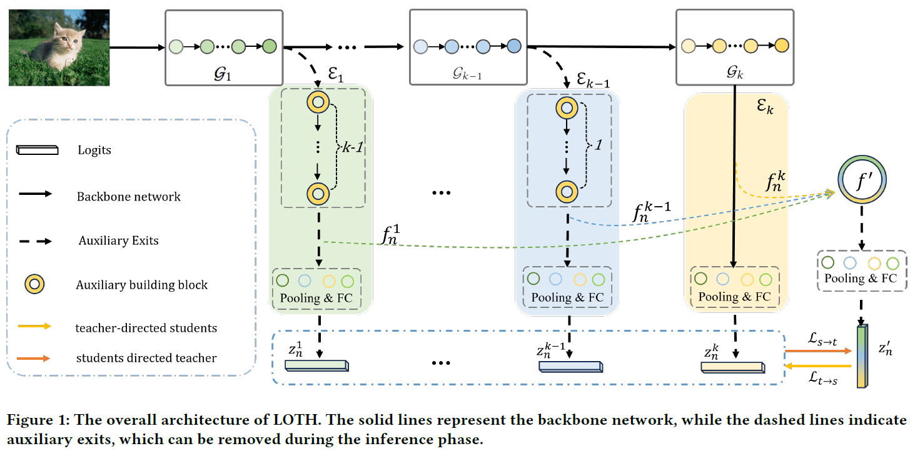

# Live on the Hump: Self Knowledge Distillation via Virtual Teacher-Students Mutual Learning.




This work proposes a novel self knowledge distillation framework named LOTH via virtual teacher-students mutual learning. LOTH constructs auxiliary exits hierarchically, which views each exit as a student and incorporates knowledge form auxiliary exits to build a knowledgeable virtual teacher. The bidirectional mutual learning between virtual teacher and students contributes significantly to the capabilities of multi-exits learning with few training overhead.


## 📚 Citation

If you find this project useful in your research, please cite:

```bibtex
@inproceedings{wang2024live,
  title={Live on the Hump: Self Knowledge Distillation via Virtual Teacher-Students Mutual Learning},
  author={Wang, Shuang and Hao, Pengyi and Wu, Fuli and Bai, Cong},
  booktitle={Proceedings of the 32nd ACM International Conference on Multimedia},
  pages={3028--3036},
  year={2024}
}
